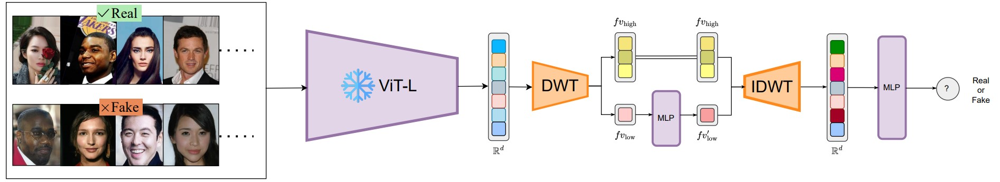

# Wavelet-CLIP
<p align="center">
  <a href="Architechture.jpg" target="_blank">
    
  </a>
</p>

This is the codebase for [HARNESSING WAVELET TRANSFORMATIONS FOR GENERALIZABLE DEEPFAKE FORGERY DETECTION](https://arxiv.org/abs/2409.18301)

This repository is based on [SCLBD/DeepfakeBench](https://github.com/SCLBD/DeepfakeBench). Utilizing their framework, we have successfully replicated existing benchmarks while introducing a new model, **Wavelet-CLIP**, which is based on self-supervised training. Our model achieves state-of-the-art performance on the **CDFv1**, **CDFv2**, and **Fsh** datasets.
# Setup
## 1. Installation
To install the required dependencies and set up the environment, run the following command in your terminal:
```bash
sh install.sh   
```
 ## 2. Dataset

All datasets are sourced from the DeepFakeBench repository, originally obtained from official websites. We are only releasing the preprocessed test sets; to access and preprocess the training sets, please look at the DeepFakeBench repository and follow the same procedure.

<div align="center">

| Dataset Name  | Link |
|---------------|------|
| Celeb-DF-v1   | -    |
| Celeb-DF-v2   | -    |
| FaceShifter   | -    |

</div>

## 3. pre-trained models
## 4. Training

**_Cross-Data Performance_**: To reproduce the results, use the provided `train.py` script. For specific detectors, download them from [link](https://github.com/lalithbharadwajbaru/Wavelet-CLIP/blob/main/training/config/detector/detector.yaml) and update the path in `./training/config/detector/detector.yaml`. An example command to train on **CDFv1** & **CDFv2** datasets, might look like this:

```bash
python3 -m torch.distributed.launch --nproc_per_node=4 training/train.py --detector_path ./training/config/detector/detector.yaml --train_dataset "FaceForensics++" --test_dataset "Celeb-DF-v1" "Celeb-DF-v2" --task_target "clip_wavelet" --no-save_feat --ddp
```
 ## 5.Testing

To reproduce the results, use the provided `test.py` script. For specific detectors, download them from [link](https://github.com/lalithbharadwajbaru/Wavelet-CLIP/blob/main/training/config/detector/clip_wavelet.yaml) and update the path in `./training/config/detector/detector.yaml`. An example command to train on **CDFv1** & **CDFv2** datasets, might look like this:

```bash
python3 training/test.py --detector_path ./training/config/detector/clip_wavelet.yaml --test_dataset "Celeb-DF-v1" "Celeb-DF-v2" "FaceShifter" --weights_path ./training/weights/clip_wavelet_best.pth
```

## 6. Testing on generated samples

**_Robustness to Unseen Deepfakes_**: To reproduce the results, use the provided `gen_test.py` script. For specific detectors, download them from [link](https://github.com/lalithbharadwajbaru/Wavelet-CLIP/blob/main/training/config/detector/clip_wavelet.yaml) and update the path in `./training/config/detector/clip.wavelet.yaml`. An example command to train on **CDFv1** & **CDFv2** datasets, might look like this:

```bash
python3 training/gen_test.py --detector_path ./training/config/detector/clip_wavelet.yaml --test_dataset "DDIM" "DDPM" "LDM" --weights_path ./training/weights/clip_wavelet_best.pth
```
# Results
| Model              | Venue      | Backbone         | Protocol         | CDFv1 | CDFv2 | Fsh  | Avg   |
|--------------------|------------|------------------|------------------|-------|-------|------|-------|
| CLIP           | CVPR-23    | ViT          | Self-Supervised  | 0.743 | 0.750 | 0.730| 0.747 |
| **Wavelet-CLIP (ours)** | -      | ViT        | Self-Supervised  | 0.756 | 0.759 | 0.732| 0.749 |


<table>
    <thead>
        <tr>
            <th>Model</th>
            <th colspan="2">DDPM</th>
            <th colspan="2">DDIM</th>
            <th colspan="2">LDM</th>
            <th colspan="2">Avg.</th>
        </tr>
        <tr>
            <th></th>
            <th>AUC</th>
            <th>EER</th>
            <th>AUC</th>
            <th>EER</th>
            <th>AUC</th>
            <th>EER</th>
            <th>AUC</th>
            <th>EER</th>
        </tr>
    </thead>
    <tbody>
        <tr>
            <td>Xception</td>
            <td>0.712</td>
            <td>0.353</td>
            <td>0.729</td>
            <td>0.331</td>
            <td>0.658</td>
            <td>0.309</td>
            <td>0.699</td>
            <td>0.331</td>
        </tr>
        <tr>
            <td>CapsuleNet</td>
            <td>0.746</td>
            <td>0.314</td>
            <td>0.780</td>
            <td>0.288</td>
            <td>0.777</td>
            <td>0.289</td>
            <td>0.768</td>
            <td>0.297</td>
        </tr>
        <tr>
            <td>Core</td>
            <td>0.584</td>
            <td>0.453</td>
            <td>0.630</td>
            <td>0.417</td>
            <td>0.540</td>
            <td>0.479</td>
            <td>0.585</td>
            <td>0.450</td>
        </tr>
        <tr>
            <td>F3-Net</td>
            <td>0.388</td>
            <td>0.592</td>
            <td>0.423</td>
            <td>0.570</td>
            <td>0.348</td>
            <td>0.624</td>
            <td>0.386</td>
            <td>0.595</td>
        </tr>
        <tr>
            <td>MesoNet</td>
            <td>0.618</td>
            <td>0.416</td>
            <td>0.563</td>
            <td>0.465</td>
            <td>0.666</td>
            <td>0.377</td>
            <td>0.615</td>
            <td>0.419</td>
        </tr>
        <tr>
            <td>RECCE</td>
            <td>0.549</td>
            <td>0.471</td>
            <td>0.570</td>
            <td>0.463</td>
            <td>0.421</td>
            <td>0.564</td>
            <td>0.513</td>
            <td>0.499</td>
        </tr>
        <tr>
            <td>SRM</td>
            <td>0.650</td>
            <td>0.393</td>
            <td>0.667</td>
            <td>0.385</td>
            <td>0.637</td>
            <td>0.397</td>
            <td>0.651</td>
            <td>0.392</td>
        </tr>
        <tr>
            <td>FFD</td>
            <td>0.697</td>
            <td>0.359</td>
            <td>0.703</td>
            <td>0.354</td>
            <td>0.539</td>
            <td>0.466</td>
            <td>0.646</td>
            <td>0.393</td>
        </tr>
        <tr>
            <td>MesoInception</td>
            <td>0.664</td>
            <td>0.372</td>
            <td>0.709</td>
            <td>0.339</td>
            <td>0.684</td>
            <td>0.353</td>
            <td>0.686</td>
            <td>0.355</td>
        </tr>
        <tr>
            <td>SPSL</td>
            <td>0.735</td>
            <td>0.320</td>
            <td>0.748</td>
            <td>0.314</td>
            <td>0.550</td>
            <td>0.481</td>
            <td>0.677</td>
            <td>0.372</td>
        </tr>
        <tr>
            <td>CLIP</td>
            <td>0.781</td>
            <td>0.292</td>
            <td>0.879</td>
            <td>0.203</td>
            <td>0.876</td>
            <td>0.210</td>
            <td>0.845</td>
            <td>0.235</td>
        </tr>
        <tr>
            <td><strong>Wavelet-CLIP</strong></td>
            <td><strong>0.897</strong></td>
            <td><strong>0.190</strong></td>
            <td><strong>0.886</strong></td>
            <td><strong>0.197</strong></td>
            <td><strong>0.897</strong></td>
            <td><strong>0.190</strong></td>
            <td><strong>0.893</strong></td>
            <td><strong>0.192</strong></td>
        </tr>
    </tbody>
</table>

# Citation
```bash
```

